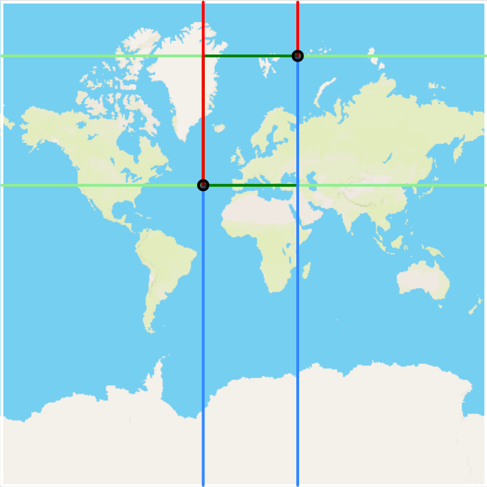

# Ship Routing using OpenStreetMap

Image of the geodesic line between two query points.  
The corresponding great-circle distance is a simple heuristic for A*. 

  
        

Image visualizing the modified "Manhattan" distance on a sphere.  
It takes into account paths passing through the north or southpole and paths wrapping around the edge of the map.  
This distance measure can serve as heuristic for grid-graphs on the sphere that are uniformly distributed over longitude and latitude degrees.

## Dependencies

### cmake:
Install using apt:  

    sudo apt-get install cmake

### g++:
Install using apt:  

    sudo apt-get install g++

### libosmbfreader:
https://github.com/CanalTP/libosmpbfreader

Install using apt:  

    sudo apt-get install libosmpbf-dev

### cpp-httplib:
https://github.com/yhirose/cpp-httplib

is installed as submodule 

## Installation

### Clone repository

    git clone --recurse-submodules https://github.com/sibmr/OpenStreetMap-Ship-Routing.git

### Install Program using CMake

    mkdir build
    cd build
    cmake -DCMAKE_BUILD_TYPE=Release ..  
    make -j4
    make install
    cd .. 

## Usage

Each program will generate an intermediate file with one of the following suffixes:
* .coastline
* .grid
* .graph

It is recommend to create a data folder to store the intermediate files as well as the planet-coastlines.pbf file.
    
    mkdir data
    mv planet-coastlines.pbf data/

Each program can get either one or two files as input parameter.
The first of the parameter will be the input file and the second one the output file.
If only one file is given, the output file will be saved in the same directory with the corresponding suffix.

The programs have to be executed in the following order (**with** the latter described arguments):

    ./build/bin/coastlineExtraction ...
    ./build/bin/pointInPolygon ...
    ./build/bin/buildGraph ...
    ./build/bin/server ...

### Extract Coastlines
The coastlineExtraction program reads a "*.pbf" file and saves it as "*.coastline" file.
From project root:
    ./build/bin/coastlineExtraction {path to pbf file} {path to new coastline file}

Example:

    ./build/bin/coastlineExtraction data/planet-coastlines.pbf data/planet.coastline

### Create File containing PointInPolygon Queries for Grid-Graph creation
The pointInPolygon program reads a "*.coastline" file and saves it as "*.grid" file.
From project root:

    ./build/bin/pointInPolygon {path to coastline file} {path to new grid file}

Example:

    ./build/bin/pointInPolygon data/planet.coastline data/planet.grid

In addition, you can select the number of nodes to be 100.000 Nodes, one million Nodes or ten million Nodes.
With the "-n" argument followed by "100K", "1M", "10M". 

Example:

    ./build/bin/pointInPolygon -n 100K data/planet.coastline data/planet.grid

### Create Adjacency Array from PointInPolygon Queries file
The buildGraph program reads a "*.grid" file and saves it as "*.graph" file.
From project root:

    ./build/bin/buildGraph {path to grid file} {path to new graph file}

Example: 

    ./build/bin/buildGraph data/planet.grid data/planet.graph

## Final Task Usage

For the final task, Adjacency Array file ending *.graph was replaced with *.graph_2 because the graph has gained additional attributes.

### Contraction Hierarchies Preprocessing
The preprocessing has a long runtime on the 1M graph. With 10 parallel threads for cost calculation, >99% contraction takes around 24 hours.  

The preprocessing runtime on the smaller 100K graph is much lower.

It requires in the current form ~1GB of disk space per contraction level on the 1M graph, because the final graph is saved after each contraction round.  

All preprocessing output file are written to the project_root/data folder. They have the following naming scheme:

     CHAdjArray_[contraction level].graph_2

The number of threads num_threads(n_threads) in the edgeDifferenceFillContractionSet method can be adjusted to fit the available resources. Please recompile after changing the value.  

From the project root: 

    ./build/bin/CH_preprocessing {path to graph file}

Example:

    ./build/bin/CH_preprocessing data/planet.graph_2

### Path Algorithm Names

All path algorithms (except the naive query) are referenced in the command line interface through their shortcut name:
* Dijkstra -> dijkstra
* Bidirectional Dijkstra -> bidijkstra
* great-crircle A* -> astar
* rectangular A* -> rectastar
* Contraction Hierarchies Bidirectional Dijkstra -> chquery
* Contraction Hierarchies great-circle A* -> chastar
* Contraction Hierarchies rectangular A* -> chrectastar

The naive version of the Dijkstra for Contraction Hierarchies is included in the code CH_query file, but is currently not accessible via CLI.

### Start Server
The server program reads a "*.graph" file and runs a server, where the user can interactively select two points on the map.  

Please note, that for Contraction Hierarchies Algorithms, the graph file needs to be one of the output files of the CH_preprocessing executable.

From project root:

    ./build/bin/server {path to graph file} {path algorithm name}

Examples:

    ./build/bin/server data/planet.graph_2 astar
    
    ./build/bin/server data/CHAdjArray_10.graph_2 chastar

Visit http://localhost:8080 using the Browser

### Benchmark and Compare Two Path Algorithms

If only benchmarking two path algorithms that are not using contraction hierarchies, the contraction hierarchies path file can be replaced by a normal graph file.  

First, the benchmark prints out all query point pairs (longitude1, latitude1), (longitude2,latitude2).    
If the calculated distances do not match, a warning is printed next to the query point.  
After that, timing and heap nodes popped comparisons are printed.  

From the project root:

     ./build/bin/benchmarkPathAlgorithm {path to graph file} {path to contraction hierarchies graph file} {path algorithm name 1} {path algorithm name 2}

or to select Dijsktra as path algorithm 1:

     ./build/bin/benchmarkPathAlgorithm {path to graph file} {path to contraction hierarchies graph file} {path algorithm name 2}

Examples:

Comparing rectangular A* to Dijkstra:

    ./build/bin/benchmarkPathAlgorithm data/planet.graph_2 data/planet.graph_2 rectastar

Comparing contraction hierarchies great-circle A* to contraction hierarchies rectangular A*:

    ./build/bin/benchmarkPathAlgorithm data/planet.graph_2 data/CHAdjArray_10.graph_2 chastar chrectastar

## Links
OSM:  
http://wiki.openstreetmap.org/wiki/Nodes​  
http://wiki.openstreetmap.org/wiki/Tags  
https://wiki.openstreetmap.org/wiki/Ways  
https://wiki.openstreetmap.org/wiki/Coastline  
Reading Data:  
https://wiki.openstreetmap.org/wiki/PBF_Format#The_code 